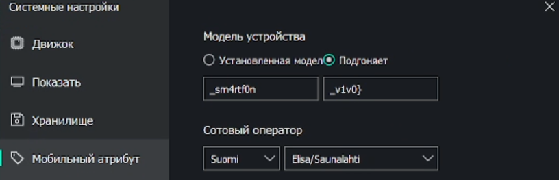

Из-за ошибки memu/моей первая часть флага осталась недоступной. 
Точную причину, почему на моём ПК в эмуляторе фотка оставалась, а на других нет - я не знаю.  
Файл с образом перезаливал заново в эмуль, фотка была. На других устройствах - нет.

Первая часть флага была в Pictures:

Вторая часть в браузере(можно было посмотреть историю):

3 и 4 часть:

 

