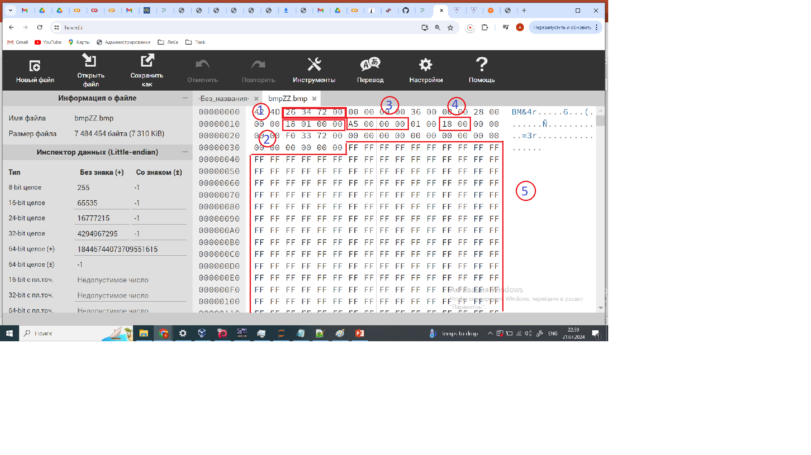
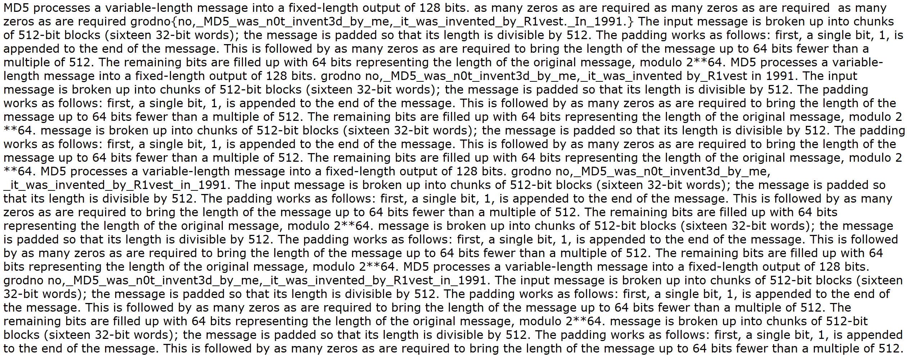

**Условие.** Всё очень просто. Флаг на картинке

==========================

**Решение.** Смотрим. Что бросается в глаза. Физический размер файла - **7484454** байт. В то же время из свойств файла **ширина х высота = 280 х 165 = 46200**. 

**Гипотеза**. У файла испорчены значения высоты и ширины. Надо исправить. ТОгда, возможно, мы увидим изображение флага.

Рассмотрим загловок файла. Значения в кодировке little-endian.

 

1) размер файла 0x00723426 = 7484454 
2) ширина изображения 0x00000118 = 280 
3) высота изображения 0x000000a5 = 165 
4) количество битов на пиксель 0x0018 = 24, три байта на пиксель 
5) данные пикселей

Отсюда следует, что изображение содержит  7484400 байт (7484454 - 54, 54 байта - размер заголовка bmp-файла). Или 7484400 / 3 = 2494800 пикселей. 

Это значит, что произведение "правильных" значений W (ширины) и H (высоты) изображения должно быть равно **W * H = 2494800**.

Разложим 2494800 на простые множителти. 
2494800 = 2**4 * 3**4 * 5**2 * 7 * 11. Всего 12 простых множителей.

Используя Wolfram Alpha (https://www.wolframalpha.com/input?i=factor+2494800) получим 300 возможных значения для ширины изображения W:

{1, 2, 3, 4, 5, 6, 7, 8, 9, 10, 11, 12, 14, 15, 16, 18, 20, 21, 22, 24, 25, 27, 28, 30, 33, 35, 36, 40, 42, 44, 45, 48, 50, 54, 55, 56, 60, 63, 66, 70, 72, 75, 77, 80, 81, 84, 88, 90, 99, 100, 105, 108, 110, 112, 120, 126, 132, 135, 140, 144, 150, 154, 162, 165, 168, 175, 176, 180, 189, 198, 200, 210, 216, 220, 225, 231, 240, 252, 264, 270, 275, 280, 297, 300, 308, 315, 324, 330, 336, 350, 360, 378, 385, 396, 400, 405, 420, 432, 440, 450, 462, 495, 504, 525, 528, 540, 550, 560, 567, 594, 600, 616, 630, 648, 660, 675, 693, 700, 720, 756, 770, 792, 810, 825, 840, 880, 891, 900, 924, 945, 990, 1008, 1050, 1080, 1100, 1134, 1155, 1188, 1200, 1232, 1260, 1296, 1320, 1350, 1386, 1400, 1485, 1512, 1540, 1575, 1584, 1620, 1650, 1680, 1782, 1800, 1848, 1890, 1925, 1980, 2025, 2079, 2100, 2160, 2200, 2268, 2310, 2376, 2475, 2520, 2640, 2700, 2772, 2800, 2835, 2970, 3024, 3080, 3150, 3240, 3300, 3465, 3564, 3600, 3696, 3780, 3850, 3960, 4050, 4158, 4200, 4400, 4455, 4536, 4620, 4725, 4752, 4950, 5040, 5400, 5544, 5670, 5775, 5940, 6160, 6237, 6300, 6480, 6600, 6930, 7128, 7425, 7560, 7700, 7920, 8100, 8316, 8400, 8910, 9072, 9240, 9450, 9900, 10395, 10800, 11088, 11340, 11550, 11880, 12474, 12600, 13200, 13860, 14175, 14256, 14850, 15120, 15400, 16200, 16632, 17325, 17820, 18480, 18900, 19800, 20790, 22275, 22680, 23100, 23760, 24948, 25200, 27720, 28350, 29700, 30800, 31185, 32400, 33264, 34650, 35640, 37800, 39600, 41580, 44550, 45360, 46200, 49896, 51975, 55440, 56700, 59400, 62370, 69300, 71280, 75600, 83160, 89100, 92400, 99792, 103950, 113400, 118800, 124740, 138600, 155925, 166320, 178200, 207900, 226800, 249480, 277200, 311850, 356400, 415800, 498960, 623700, 831600, 1247400, 2494800}

Соответственно, H = 2494800 // W. Логично предположить, что изображение имеет форму , близкую к квадрату. В итоге:

 

