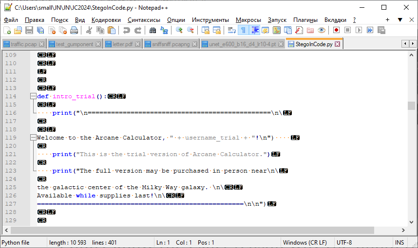

Открываем файл в Notepad++.  
Режим "Вид" - "Отображение символов" - "Отображать все символы" 

 

<!---->

Гипотеза: Сообщение скрыто с использованием кодировки CR/LF и LF/CR.

# Пишем скрипт для извлечения сообщения
fi = open("StegoInCode.py", 'rb').read()
stego = ""
ib = 0
while ib < len(fi)-1:
    if fi[ib:ib+2] == b'\x0a\x0d':  # CR/LF
        stego += '0'
        ib += 2
    elif fi[ib:ib+2] == b'\x0d\x0a': # LF/CR
        stego += '1'
        ib += 2
    else:
        ib += 1
# Получили битовую строку        
print (stego)
print ()
# Переводим ее в ASCII и видим флаг
print ("".join([chr(int(stego[i:i+8],2)) for i in range(0, len(stego), 8)]))

ÿÿÿgrodno{stego_vs_cryptography}ÿÿÿÿÿÿÿ?
