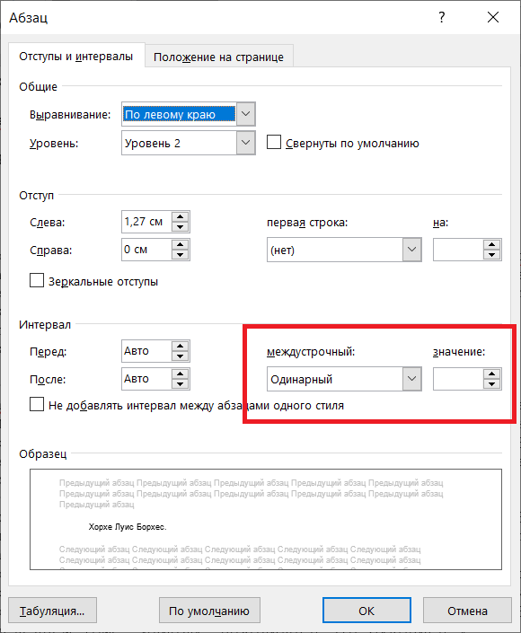

**Условие**. ". . . мыслитель заметил, все книги, как бы различны они ни были, состоят из одних и тех же элементов: расстояния между строками и буквами, точки, запятой, двадцати двух букв алфавита. Он же обосновал явление, отмечавшееся всеми странниками: во всей огромной Библиотеке нет двух одинаковых книг."
© Х.Л.Борхес. Вавилонская библиотека

=============================

**Решение**. Буквально следуем названию задачи и цитате Борхеса - " ... все книги, как бы различны они ни были, состоят из одних и тех же элементов: расстояния между строками ..."

Проанализируем, используя только инструменты MS Office, предложенный текст. Используя форму "Абзац". Достаточно посмотреть первые 10 абзацев, чтобы заметить, что использованы 2 межстрочных интервала: "Одинарный" и "Множитель 1.01"

<table><tr alogn=center>
<td align="center">

 

</td>
<td align="center">

 

</td>
</tr></table>

**Гипотеза**. Для сокрытия информации используется бинарна кодировка

