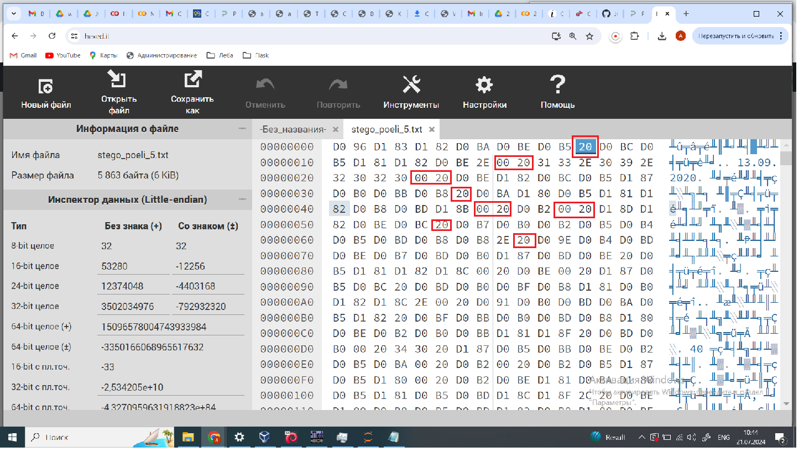
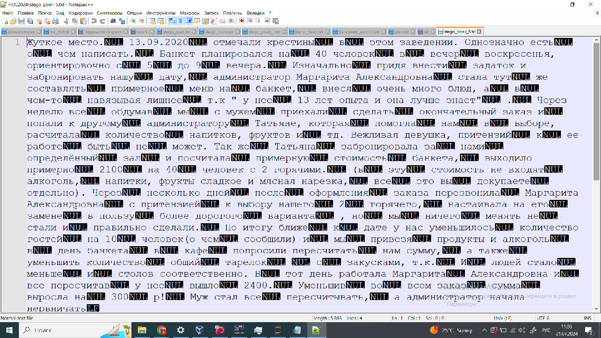

Открываем файл в Hex-editir'e (Например, https://hexed.it/). Зачечаем, что текст в кодировке UTF-8, а пробелы в нем представлены в двух видах: как 0x20 или как 0x0020.

 

Или смотрим этот файл в Notepad++

 

Гипотеза: Сообщение скрыто с использованием кодировки 0x20 и 0x0020.
<pre>
# Пишем скрипт для извлечения сообщения
fi = open("/content/sample_data/stego_poeli_5.txt", 'rb').read()
print (fi)
stego = ""
ib = 0
while ib < len(fi)-1:
    if fi[ib:ib+2] == b'\x00\x20':  # 0020
        stego += '1'
        ib += 2
    elif fi[ib] == 0x20: # 20
        stego += '0'
        ib += 1
    else:
        ib += 1
# Получили битовую строку        
print (stego)
print ()
# Переводим ее в ASCII и видим флаг
print ("".join([chr(int(stego[i:i+8],2)) for i in range(0, len(stego), 8)]))

011011000110100101110011011101000110010101101110001110100010000001100111011100100110111101100100011011100110111101111011010001110011000001101101011101010100111001101011011101010100110001010101011100110111010101011111011011100100010101011111011011100110000101001100001100010111011001100001010101000111001101111101001000000010000100000000000000000000000000000000000000000000000000000000000000000000000000000000000000000000000000000000000000000000000000000000000000000000000000000000000000000000000000000000000000000

listen: grodno{G0muNkuLUsu_nE_naL1vaTs} !������������������������

</pre>
